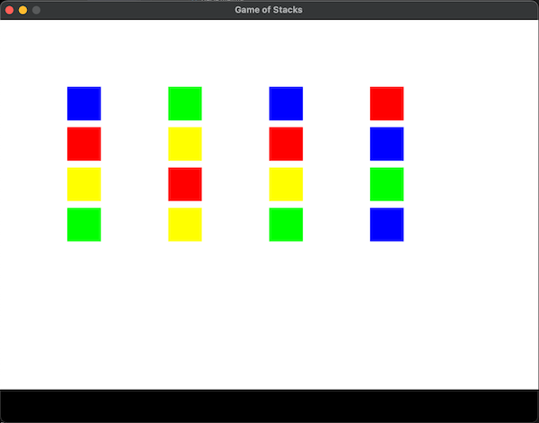

# PyGame Block Sort

Welcome to **PyGame Block Sort**, an engaging and strategic puzzle game. Sort colored blocks into stacks and test your problem-solving skills as the game becomes progressively more challenging.



## Features

- Intuitive gameplay mechanics that are easy to learn but hard to master.
- Clean and colorful graphics for an enjoyable visual experience.
- Increasing difficulty with each level to keep you engaged and challenged.

## Installation

Ensure Python 3.6 or later is installed on your system. Follow these steps to get started:

## Objective
The goal of the game is to sort the squares into stacks by color. Each stack must contain squares of only one color, and all stacks must be complete to win the level.

## How to Play
- Click on a square to move it to another stack with available space.
- A stack can contain a maximum number of squares as defined for the current level.
- To complete a level, all stacks must contain squares of the same color.
- Upon completing a level, the number of squares per stack increases, and the game reshuffles the colors for the next level.
- The game ends when you reach a level that has more squares per stack than the number of available colors.

## Controls
- **Left Mouse Click**: Use the mouse to click and move the squares between the stacks.
- **Mouse Hover**: The mouse cursor highlights the squares when hovering over them.

## Difficulty Levels
- The game starts with 3 squares per stack.
- With each completed level, the number of squares per stack increases by one.
- The maximum number of squares per stack is limited by the number of available colors.

Good luck and have fun organizing the stacks!

```bash
# Clone the repository
git clone https://github.com/romuloigor/pygame_block_sort.git

# Navigate to the game directory
cd pygame_block_sort

# Install the required packages
pip install -r requirements.txt

# Start the game
python game_of_stacks.py
```

## Compatible Python Versions

This game has been tested and is compatible with the following Python versions:

- Python 3.6
- Python 3.7
- Python 3.8
- Python 3.9
- Python 3.10

## License

This project is licensed under the MIT License - see the [LICENSE](LICENSE.md) file for details.

## Contributing

Contributions are welcome and greatly appreciated. If you have suggestions or improvements, please follow these steps:

1. Fork the Project
2. Create your Feature Branch (`git checkout -b feature/AmazingFeature`)
3. Commit your Changes (`git commit -m 'Add some AmazingFeature'`)
4. Push to the Branch (`git push origin feature/AmazingFeature`)
5. Open a Pull Request

## Authors

- **Rômulo Igor** - Initial Work - [romuloigor](https://github.com/romuloigor)

## Acknowledgments

- pygame 2.5.2 (SDL 2.28.3, Python 3.10.6)
- Hello from the pygame community. https://www.pygame.org/contribute.html

- A big thank you to the PyGame community for their resources and support.
- Thanks to all game testers and players for their feedback and suggestions.

Star the repository if you like this game!